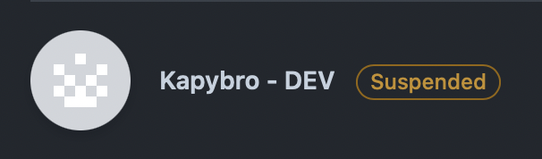

# ❓ FAQ (Frequently asked questions)

## Q: I don't see my organization / installation in the dashboard

.png>)

Check that your installation on GitHub is not suspended. Also you must be an org admin/owner to be able to manage your installation.

Visit [https://github.com/organizations/\<ORGNAME>/settings/installations](https://github.com/organizations/kafbat/settings/installations) and check the status:

<figure><figcaption>
Suspended installation
</figcaption></figure>

You can unsuspend the installation in its settings:

<figure><figcaption>
Unsuspend installation
</figcaption></figure>

